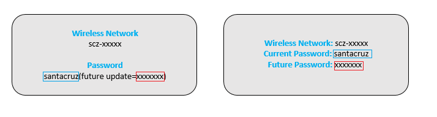

# Project Santa Cruz Development Kit unboxing and setup

Reference this guide for information on connecting the devkit components and powering on the device.

## Prerequisites

- Project Santa Cruz Devkit.
- P7 screwdriver (optional, used for securing the power cable connector to the carrier board).

## Devkit unboxing and setup procedure

1. Unbox the devkit components.

    - The devkit contains a carrier board, Azure Eye SoM, Azure Ear SoM, RGB camera, accessories box with antennas and required cables, a section of 80/20 1010 Series mounting rail, and a welcome card with a hex key.
	
	- The welcome card includes a sticker that has two passwords needed to access the dev kit's wifi access point. The first password is "santacruz" and is what should be used with the dev kit out of the box. The second password is "scz-***xxxx***" (where ***xxxx*** are the last four digits of the dev kit's MAC address), and will be activated after you upgrade the dev kit to the latest OS version. **DO NOT LOSE THIS PASSWORD**. 
	
	

    - The major components come mounted to the 80/20 rail out of the box, but they can be removed or adjusted with the included hex key as desired.

1. Connect the devkit components:

    > [!NOTE]
    > The power adapter port is located on the right side of the carrier board. The remaining ports (2x USB-A, 1x USB-C, 1x HDMI, and 1x Ethernet) and the reset button are located on the left side of the carrier board.

    1. Hand screw both Wi-Fi antennas into the carrier board.

    1. Connect the Azure Eye SoM to the carrier board's USB-C port with the USB-C cable.

    1. Connect the Azure Ear SoM to the carrier board with the USB Micro Type-B to USB Type-A cable. Connect the Micro Type-B end of the cable to the SoM and the Type-A end to the carrier board.

    1. Connect the power cable to the power adapter.

    1. Remove any remaining plastic packaging from the devices.

    1. Connect the power adapter/cable to the carrier board and a wall outlet. To fully secure the power cable connector to the carrier board, use a P7 screwdriver (not included in the devkit) to tighten the connector screws. 
    
    1. After plugging the power cable into a wall outlet, the device will automatically power on. The reset button on the left side of the carrier board will be illuminated, and the Ear SoM LEDs will turn green, indicating device authentication is in progress (specifically, the LED marked L01 will turn on and remain green, and LED L02 will flash green). Please allow some time for the device to boot up.

        > [!NOTE]
        > The reset button is for powering off or resetting the device while connected to a power outlet. In the event of a power outage, the device will automatically reset and power back on.

## Next steps

Now that your devkit is powered on, please see the [OOBE (out-of-box-experience) walkthrough](https://github.com/microsoft/Project-Santa-Cruz-Private-Preview/blob/main/user-guides/getting_started/oobe.md) for guidance on connecting to and working through the OOBE. The OOBE allows you to connect your devkit to a Wi-Fi network, set up an SSH login, and provision it to your Azure account. Once you have completed the OOBE, you will be ready to dive into our prototyping experiences.
